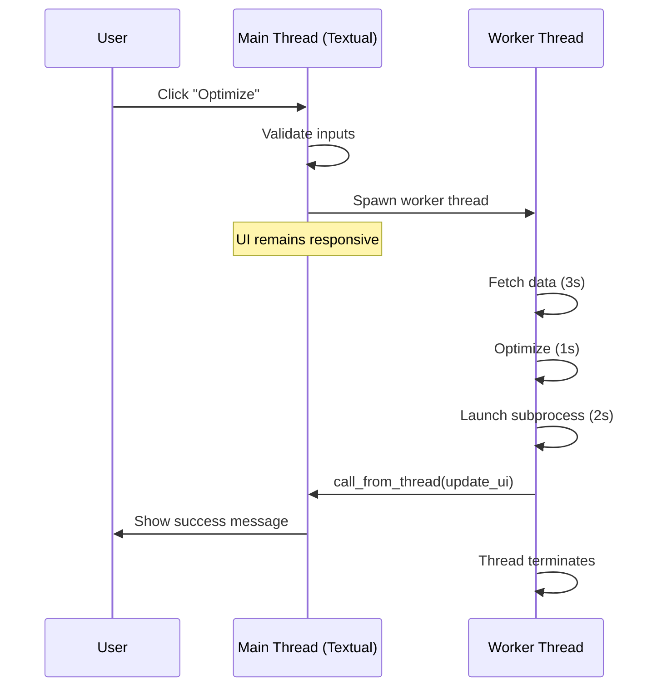

# ADR-0002: Worker Thread Pattern for Blocking Operations

**Status**: Accepted

**Date**: 2024-01-15

**Deciders**: Development Team

## Context

Terminal Portfolio Optimizer performs several blocking operations:
1. **Network I/O**: Fetching stock data from vnstock3 API (2-5 seconds)
2. **CPU-intensive**: Portfolio optimization with CVXPY solver (500ms-1s)
3. **Subprocess management**: Launching and waiting for PyWebView process (1-2 seconds)

Running these operations on Textual's main event loop would:
- Freeze the entire UI during execution
- Make the application unresponsive to keyboard input (Ctrl+C, 'q')
- Create poor user experience with no feedback during long operations
- Block the async event loop, preventing animations and updates

Textual provides several concurrency primitives:
- `asyncio` tasks (for async operations)
- Worker threads (for blocking operations)
- Timers (for periodic tasks)

## Decision

We will use **Textual's worker thread pattern** (`@work` decorator) for all blocking operations:

1. Decorate blocking methods with `@work(thread=True, exclusive=True)`
2. Run data fetching, optimization, and visualization in worker threads
3. Use `self.app.call_from_thread()` for thread-safe UI updates
4. Keep main event loop free for UI rendering and event handling

### Implementation Pattern

```python
@work(thread=True, exclusive=True)
def run_optimization_worker(self):
    # Runs in separate thread
    try:
        # Blocking operation 1: Data fetching
        data = fetch_vn_stock_data(...)

        # Blocking operation 2: Optimization
        result = get_max_sharpe_allocation(...)

        # Blocking operation 3: Visualization
        display_charts(html)

        # Thread-safe UI update
        self.app.call_from_thread(
            self.query_one("#success-message").update,
            "Optimization complete!"
        )
    except Exception as e:
        self.app.call_from_thread(
            self.query_one("#error-message").update,
            f"Error: {e}"
        )
```

## Consequences

### Positive

- **Responsive UI**: Main event loop stays free, UI never freezes
- **Keyboard control**: User can quit anytime with 'q' or Ctrl+C
- **Simple programming model**: Synchronous code in worker thread, no async/await complexity
- **Exclusive execution**: `exclusive=True` prevents concurrent optimizations
- **Clean error handling**: Exceptions caught in worker, displayed via UI updates
- **Progress indicators**: Could add progress bars/spinners while worker runs

### Negative

- **Threading complexity**: Must remember to use `self.app.call_from_thread()` for UI updates
- **No cancellation**: Once started, worker runs to completion (can't abort mid-optimization)
- **Memory overhead**: Each worker thread uses ~8MB of stack space
- **Debugging difficulty**: Thread context switches make debugging slightly harder

### Risks

- **Incorrect UI updates**: Using `self.call_from_thread()` instead of `self.app.call_from_thread()` causes `AttributeError`
  - *Mitigation*: Documented in CLAUDE.md, linter could catch this
- **Worker thread leaks**: If worker never completes, thread persists
  - *Mitigation*: Timeouts on network operations, `exclusive=True` prevents pileup
- **Race conditions**: Multiple threads accessing shared state
  - *Mitigation*: `exclusive=True` ensures only one worker runs at a time

## Alternatives Considered

### Option 1: Async/await with `asyncio`

**Approach**: Use async functions and `await` for operations

```python
async def run_optimization(self):
    data = await fetch_vn_stock_data_async(...)
    result = await optimize_async(...)
```

**Pros**:
- More efficient than threads (no OS thread overhead)
- Native Textual pattern (Textual uses asyncio)
- Better cancellation support

**Cons**:
- vnstock3, PyPortfolioOpt, and PyWebView are **not async**
- Would require wrapping all blocking calls with `run_in_executor()`
- More complex code: async/await propagates throughout codebase
- No performance benefit (operations are genuinely blocking, not I/O-multiplexable)

**Reason for rejection**: Libraries are not async-native, no clear benefit

### Option 2: Run blocking operations on main thread

**Approach**: Accept that UI will freeze during optimization

**Pros**:
- Simplest code (no threading)
- No thread-safety concerns

**Cons**:
- Completely unacceptable UX (frozen UI for 5-10 seconds)
- Can't quit during optimization
- Looks like the application crashed

**Reason for rejection**: Poor user experience

### Option 3: Use `multiprocessing` instead of threading

**Approach**: Run optimization in separate process

**Pros**:
- True parallelism (no GIL)
- Process isolation (crashes don't affect main app)

**Cons**:
- Heavy overhead (~50MB per process)
- Must serialize data between processes (pickle overhead)
- Optimization is already fast enough (~1s), not CPU-bound enough to benefit
- Already using multiprocessing for PyWebView (ADR-0001)

**Reason for rejection**: Overkill for this use case, already using for PyWebView

### Option 4: Show progress with `asyncio.to_thread()`

**Approach**: Use asyncio's built-in thread pool

```python
async def run_optimization(self):
    data = await asyncio.to_thread(fetch_vn_stock_data, ...)
```

**Pros**:
- Standard library solution
- Slightly simpler than Textual workers

**Cons**:
- Still need Textual workers for UI updates
- `to_thread()` is just a wrapper around ThreadPoolExecutor
- Textual workers integrate better with Textual lifecycle
- No `exclusive` flag (would need custom lock)

**Reason for rejection**: Textual workers are purpose-built for this

## Thread Safety Guidelines

### CORRECT: UI updates from worker thread

```python
# In Screen class, use self.app.call_from_thread()
self.app.call_from_thread(widget.update, data)
```

**Why?** `Screen` class doesn't inherit `call_from_thread()` method. Must access via parent `PortfolioApp` instance.

### INCORRECT: Direct UI updates

```python
# AttributeError: 'InputScreen' object has no attribute 'call_from_thread'
self.call_from_thread(widget.update, data)
```

### INCORRECT: Direct widget mutation

```python
# NOT THREAD-SAFE: Mutating widget from worker thread
self.query_one("#success-message").update("Done!")
```

## Worker Lifecycle



## Performance Implications

| Operation | Duration | Thread Type | Blocks Main Thread? |
|-----------|----------|-------------|---------------------|
| Input validation | <10ms | Main | Yes (acceptable) |
| Data fetching | 2-5s | Worker | No |
| Optimization | 500ms-1s | Worker | No |
| Subprocess spawn | 1-2s | Worker | No |
| UI update | <10ms | Main (via call_from_thread) | Yes (acceptable) |

**Total perceived latency**: 0ms (UI stays responsive throughout)

## References

- Textual Workers Guide: https://textual.textualize.io/guide/workers/
- Python Threading Documentation: https://docs.python.org/3/library/threading.html
- Related: [ADR-0001: Multiprocessing for PyWebView](./0001-multiprocessing-for-webview.md)
- Implementation: `src/main.py:143-212` (run_optimization_worker method)
