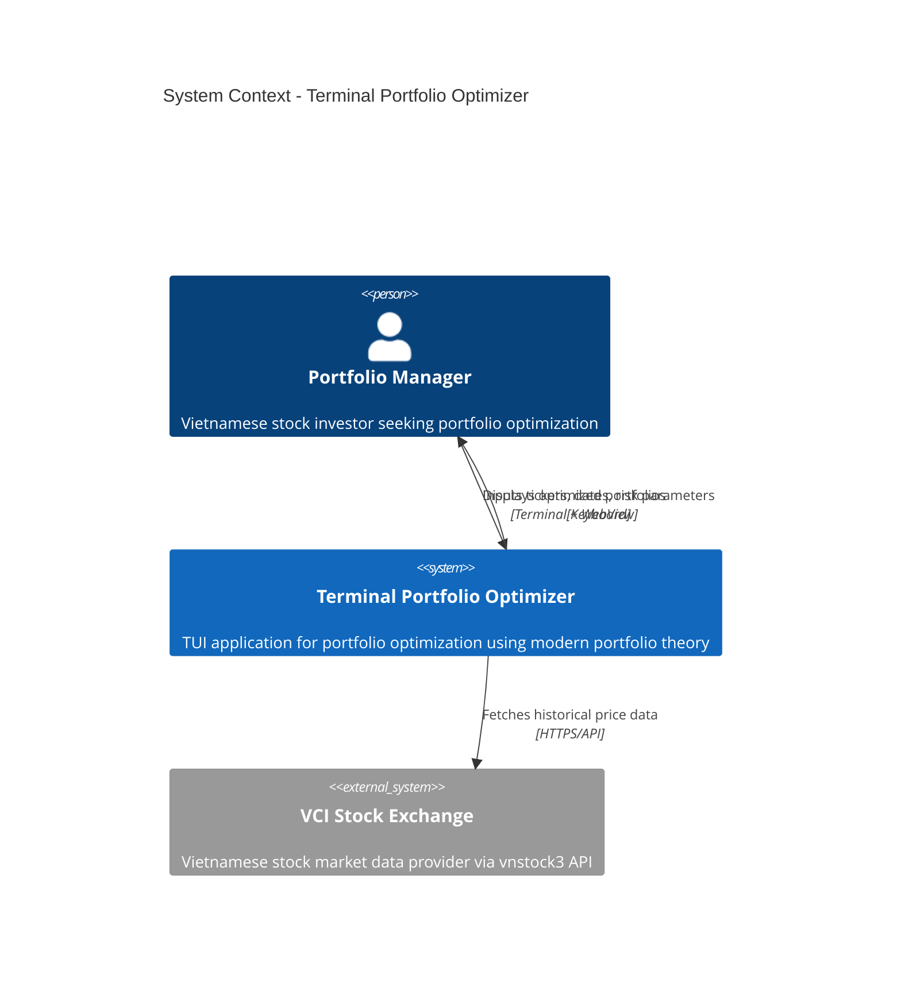
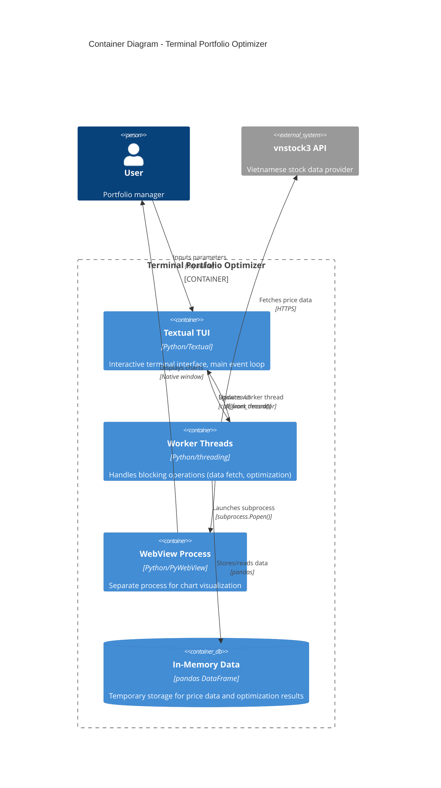
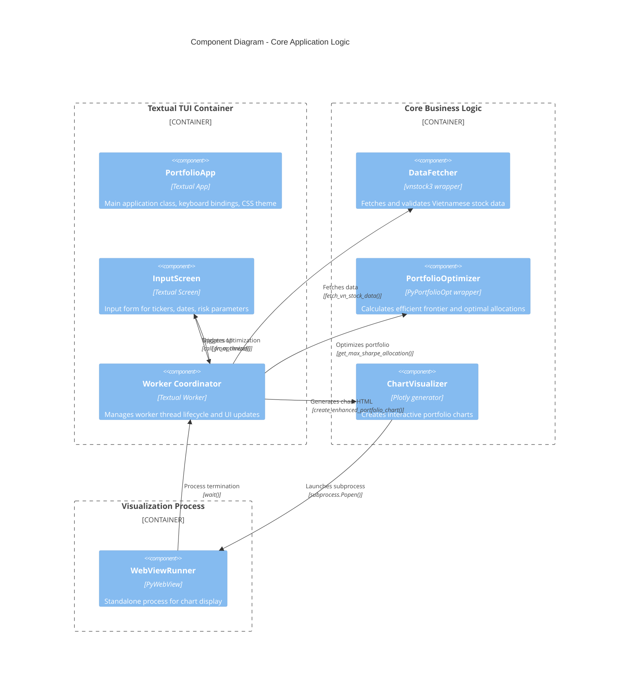

# C4 Model Architecture

This document follows the [C4 Model](https://c4model.com/) for visualizing software architecture at multiple levels of abstraction.

## Level 1: System Context Diagram



### External Dependencies
- **VCI Stock Exchange**: Provides real-time and historical Vietnamese stock data via vnstock3 API
- **Terminal Environment**: macOS/Linux terminal with Python 3.10+

### User Personas
- **Portfolio Manager**: Needs quick portfolio optimization for Vietnamese stocks
- **Retail Investor**: Seeks data-driven allocation recommendations
- **Risk Analyst**: Requires multiple optimization strategies (Max Sharpe, Min Vol, Max Utility)

## Level 2: Container Diagram



### Container Responsibilities

#### Textual TUI (`src/main.py`)
- **Purpose**: Main application entry point and UI coordination
- **Technology**: Textual framework, runs on main thread
- **Key Classes**: `PortfolioApp`, `InputScreen`
- **Critical Constraint**: MUST run on main thread for event loop

#### Worker Threads
- **Purpose**: Execute blocking operations without freezing UI
- **Technology**: Python threading with `@work(thread=True)` decorator
- **Scope**: Data fetching, optimization calculations, subprocess management
- **Thread Safety**: All UI updates use `self.app.call_from_thread()`

#### WebView Process (`src/webview_process.py`)
- **Purpose**: Display Plotly charts in native window
- **Technology**: PyWebView with subprocess isolation
- **Critical Constraint**: MUST run on own main thread (macOS Cocoa requirement)
- **Communication**: Base64-encoded HTML via command-line arguments

#### In-Memory Data Store
- **Purpose**: Temporary storage during optimization session
- **Technology**: pandas DataFrame
- **Lifecycle**: Created per optimization run, discarded after visualization
- **No Persistence**: Application is stateless between runs

## Level 3: Component Diagram



### Component Details

#### src/main.py
- **PortfolioApp**: Application root, manages global state and keyboard bindings
- **InputScreen**: Form validation, worker thread spawning, UI update coordination
- **run_optimization_worker()**: Worker method decorated with `@work(thread=True, exclusive=True)`

#### src/data_fetcher.py
- **fetch_vn_stock_data()**: Retrieves historical prices using vnstock3 Quote API
- **validate_tickers()**: Basic ticker symbol validation
- **DataFetchError**: Custom exception for data retrieval failures

#### src/optimizer.py
- **calculate_efficient_frontier()**: Generates 100-point risk-return curve
- **get_max_sharpe_allocation()**: Maximum Sharpe ratio portfolio
- **get_min_volatility_allocation()**: Minimum variance portfolio
- **get_max_utility_allocation()**: Quadratic utility optimization with risk aversion λ
- **generate_random_portfolios()**: 10,000 random portfolios via Dirichlet distribution
- **OptimizationError**: Custom exception for optimization failures

#### src/visualizer.py
- **create_enhanced_portfolio_chart()**: 2-row, 3-column Plotly chart (WebGL optimized)
- **display_charts()**: Subprocess launcher with base64 HTML encoding

#### src/webview_process.py
- **main()**: Standalone entry point, decodes HTML, calls `webview.start()`
- **Process lifecycle**: Owned by subprocess, terminates on window close

## Level 4: Code Organization

```
terminal-portfolio-optimizer/
├── src/
│   ├── __init__.py              # Package initialization
│   ├── main.py                  # Textual TUI application (PortfolioApp, InputScreen)
│   ├── data_fetcher.py          # vnstock3 integration (fetch_vn_stock_data)
│   ├── optimizer.py             # PyPortfolioOpt integration (3 optimization strategies)
│   ├── visualizer.py            # Plotly chart generation + subprocess launcher
│   ├── webview_process.py       # Standalone PyWebView runner
│   └── theme.tcss               # Bloomberg-inspired Textual CSS
├── docs/
│   └── architecture/            # Architecture documentation
├── pyproject.toml               # Project metadata and dependencies
├── CLAUDE.md                    # Development guidelines and critical patterns
├── CHANGELOG.md                 # Version history
└── README.md                    # User-facing documentation
```

### Key Design Patterns

#### Worker Thread Pattern
```python
@work(thread=True, exclusive=True)
def run_optimization_worker(self):
    # Blocking operations run in separate thread
    data = fetch_vn_stock_data(...)
    allocation = get_max_sharpe_allocation(...)

    # UI updates are thread-safe
    self.app.call_from_thread(widget.update, result)
```

#### Subprocess Isolation Pattern
```python
# In visualizer.py
html_b64 = base64.b64encode(html.encode()).decode()
process = subprocess.Popen([
    sys.executable,
    webview_process_path,
    html_b64
])
process.wait()  # Non-blocking for worker thread
```

#### Thread-Safe UI Update Pattern
```python
# CORRECT: From Screen class
self.app.call_from_thread(widget.update, data)

# INCORRECT: AttributeError (Screen doesn't inherit this)
self.call_from_thread(widget.update, data)
```

## Cross-Cutting Concerns

### Error Handling
- Domain-specific exceptions: `DataFetchError`, `OptimizationError`
- All errors displayed in TUI's `#error-message` widget
- No crashes - application returns to input state

### Logging
- Currently uses print statements for warnings (e.g., failed ticker fetches)
- Future: Structured logging with log levels

### Configuration
- Hardcoded defaults in `InputScreen` (1-year lookback, 3% risk-free rate, λ=1.0)
- No external configuration files

### State Management
- Stateless design: Each optimization run is independent
- Input fields retain values between runs
- No database or file persistence
