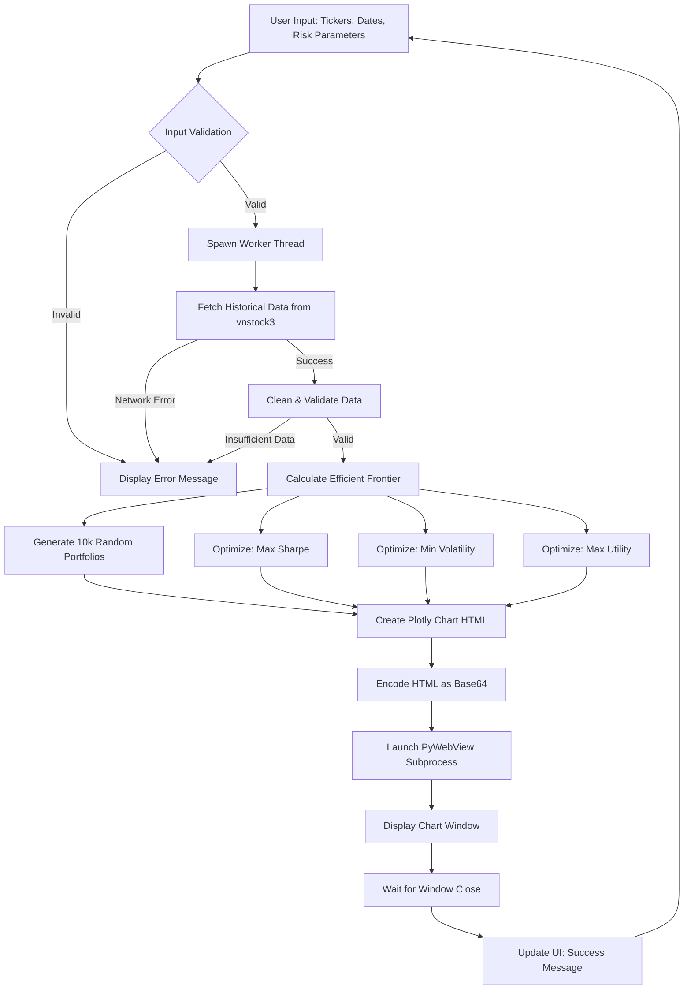
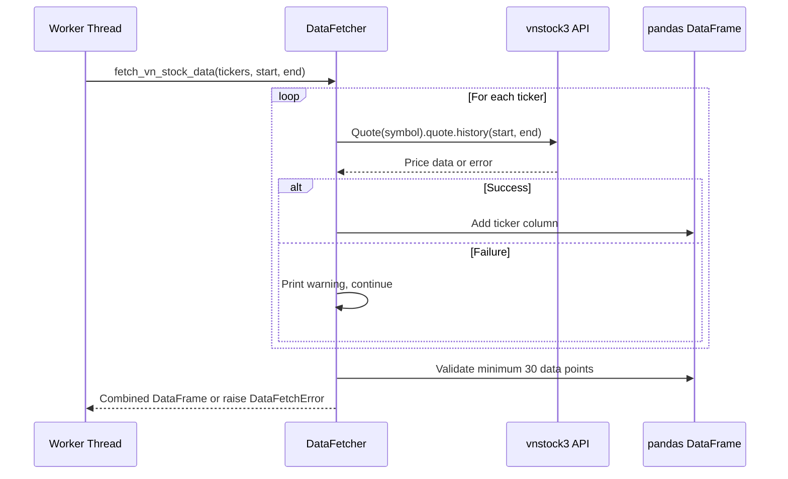
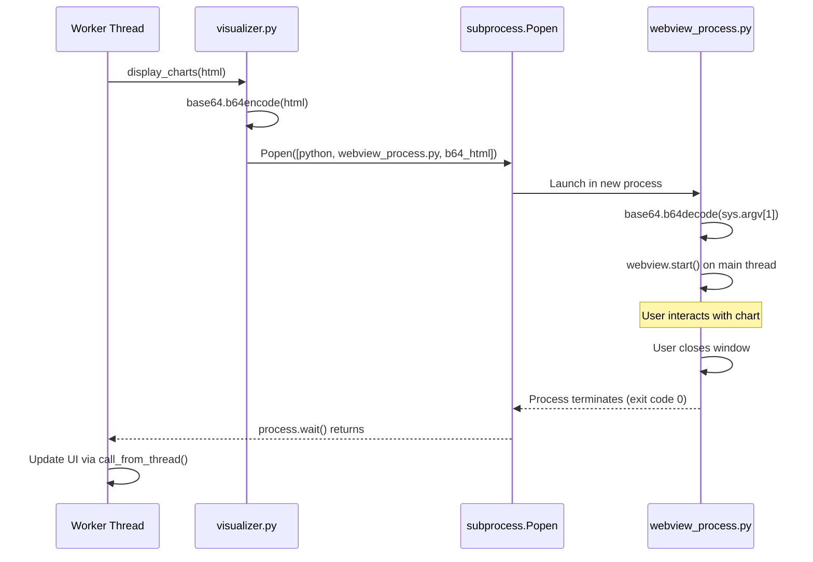
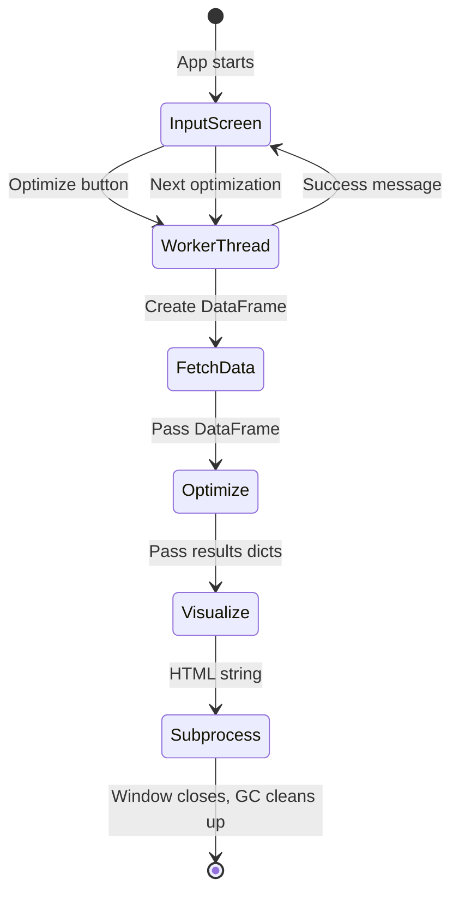
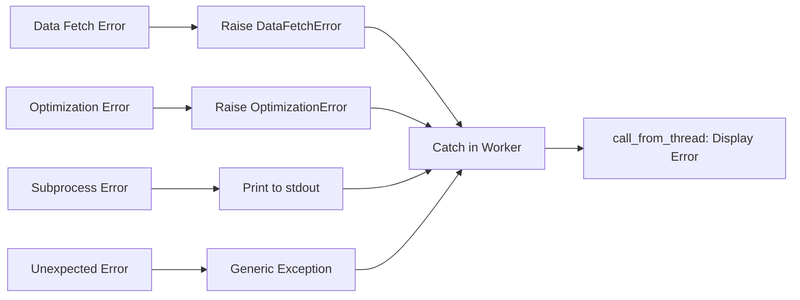

# Data Flow Architecture

End-to-end data processing pipeline from user input to visualization.

## High-Level Data Flow



## Detailed Data Flow Stages

### Stage 1: User Input Collection

**Component**: `InputScreen` (src/main.py:43-212)

**Inputs**:
- Stock tickers (comma-separated string)
- Start date (YYYY-MM-DD format)
- End date (YYYY-MM-DD format)
- Risk-free rate (float, percentage)
- Risk aversion parameter (float, λ ≥ 0)

**Validation**:
```python
# src/main.py:146-179
def validate_inputs(tickers_str, start_date, end_date, rf_rate, risk_aversion):
    # Checks:
    # - At least 2 tickers provided
    # - Valid date format (YYYY-MM-DD)
    # - Start date < End date
    # - Risk-free rate is numeric and 0-100%
    # - Risk aversion is numeric and >= 0
```

**Output**: Dictionary of validated parameters passed to worker thread

**Error Handling**:
- Synchronous validation before worker spawn
- Errors displayed in `#error-message` widget
- No state change on validation failure

---

### Stage 2: Historical Data Fetching

**Component**: `data_fetcher.fetch_vn_stock_data()` (src/data_fetcher.py:35-121)

**Process**:


**Data Structure**:
```python
# Input: List of ticker strings
tickers = ["FPT", "VNM", "VIC"]

# Output: pandas DataFrame
#         FPT     VNM     VIC
# 2024-01-01  95.5   120.3   85.7
# 2024-01-02  96.2   119.8   86.1
# ...
```

**Error Conditions**:
- Network failure: Raises `DataFetchError`
- Invalid ticker: Prints warning, continues with valid tickers
- Insufficient data (<30 points): Raises `DataFetchError`

**Performance**:
- Network-dependent (typically 2-5 seconds for 3-5 tickers)
- Sequential fetching (no parallelization)
- No caching between runs

---

### Stage 3: Portfolio Optimization

**Component**: `optimizer.py` (multiple functions)

#### 3a. Efficient Frontier Calculation

**Function**: `calculate_efficient_frontier()` (src/optimizer.py:18-61)

**Process**:
```python
# Input: Historical prices DataFrame
prices = pd.DataFrame(...)  # From Stage 2

# Calculate expected returns and covariance
mu = mean_historical_return(prices, returns_data=False)
S = sample_cov(prices, returns_data=False)

# Generate 100 target returns between min and max
target_returns = np.linspace(min_ret, max_ret, 100)

# For each target, minimize volatility
for target in target_returns:
    ef = EfficientFrontier(mu, S)
    ef.efficient_return(target)
    vol = ef.portfolio_performance()[1]
    frontier.append((vol, target))
```

**Output**: List of 100 (volatility, return) tuples

#### 3b. Random Portfolio Generation

**Function**: `generate_random_portfolios()` (src/optimizer.py:149-195)

**Process**:
```python
# Generate 10,000 random portfolios using Dirichlet distribution
n_assets = len(prices.columns)
for _ in range(10_000):
    weights = np.random.dirichlet(np.ones(n_assets))
    ret, vol, sharpe = calculate_performance(weights, mu, S, rf_rate)
    random_portfolios.append((vol, ret, sharpe))
```

**Output**: DataFrame with columns `Volatility`, `Return`, `Sharpe`

#### 3c. Optimal Portfolio Strategies

**Functions**:
- `get_max_sharpe_allocation()` (src/optimizer.py:64-92)
- `get_min_volatility_allocation()` (src/optimizer.py:95-123)
- `get_max_utility_allocation()` (src/optimizer.py:126-146)

**Strategy Comparison**:

| Strategy | Objective | Constraint | Use Case |
|----------|-----------|------------|----------|
| Max Sharpe | Maximize (Rp - Rf) / σp | Weights sum to 1 | Risk-adjusted return optimization |
| Min Volatility | Minimize σp | Weights sum to 1 | Conservative, capital preservation |
| Max Utility | Maximize Rp - λσp² | Weights sum to 1 | User-customizable risk preference |

**Output Format**:
```python
{
    'allocation': {'FPT': 0.35, 'VNM': 0.45, 'VIC': 0.20},
    'performance': {
        'return': 0.156,  # 15.6% annual return
        'volatility': 0.234,  # 23.4% annual volatility
        'sharpe': 0.534  # Sharpe ratio
    }
}
```

**Performance**: < 1 second for typical portfolios (2-10 assets)

---

### Stage 4: Visualization Generation

**Component**: `visualizer.create_enhanced_portfolio_chart()` (src/visualizer.py:27-377)

**Chart Layout**:
```
┌─────────────────────────────────────────────────────┐
│  Efficient Frontier + Random Portfolios (WebGL)     │
│  - 1,000 random portfolios (colored by Sharpe)      │
│  - Efficient frontier curve (100 points)            │
│  - 3 optimal portfolios (star markers)              │
└─────────────────────────────────────────────────────┘
┌──────────────┬──────────────┬──────────────────────┐
│  Max Sharpe  │ Min Volatility│   Max Utility        │
│  Pie Chart   │  Pie Chart    │   Pie Chart          │
└──────────────┴──────────────┴──────────────────────┘
```

**Data Transformation**:
```python
# Random portfolios: DataFrame → Plotly Scattergl (WebGL)
fig.add_trace(go.Scattergl(
    x=random_portfolios['Volatility'],
    y=random_portfolios['Return'],
    mode='markers',
    marker=dict(
        color=random_portfolios['Sharpe'],
        colorscale='Viridis',
        size=3
    )
), row=1, col=1)

# Efficient frontier: List of tuples → Plotly Scatter
frontier_vols, frontier_rets = zip(*frontier)
fig.add_trace(go.Scatter(
    x=frontier_vols,
    y=frontier_rets,
    mode='lines'
), row=1, col=1)

# Optimal portfolios: Dict → Plotly Pie
for strategy in [max_sharpe, min_vol, max_util]:
    fig.add_trace(go.Pie(
        labels=list(strategy['allocation'].keys()),
        values=list(strategy['allocation'].values())
    ), row=2, col=i)
```

**Output**: HTML string (~500KB) with embedded Plotly JavaScript

**WebGL Optimization**:
- Uses `go.Scattergl` instead of `go.Scatter` for 1,000+ points
- Reduces DOM nodes and rendering time by ~70%

---

### Stage 5: Chart Display

**Component**: `visualizer.display_charts()` → `webview_process.py` (subprocess)

**Subprocess Communication**:


**Data Encoding**:
```python
# Encode HTML as base64 for safe CLI passing
html_bytes = html_content.encode('utf-8')
html_b64 = base64.b64encode(html_bytes).decode('ascii')

# Pass as command-line argument
subprocess.Popen([sys.executable, webview_process_path, html_b64])
```

**Why Base64?**
- Avoids shell escaping issues with special characters
- Safer than stdin on macOS (Cocoa main thread requirements)
- Single argument simpler than temp files

**Window Lifecycle**:
1. Process spawned with encoded HTML
2. PyWebView creates native window (NSWindow on macOS)
3. User views/interacts with chart
4. User closes window → `webview.start()` returns
5. Process exits with code 0
6. Worker thread resumes, updates UI

---

## Data Persistence and State Management

### No Persistent Storage
- All data stored in memory (pandas DataFrames, Python dicts)
- Application is **stateless** between optimization runs
- No database, no file writes

### Session State
```python
# State retained in InputScreen widgets between runs
self.query_one("#tickers").value  # String persists
self.query_one("#start-date").value  # String persists
# ... other input fields ...
```

**Rationale**:
- Allows users to tweak parameters without re-entering all data
- No sensitive data persistence (no security risk)

### Memory Lifecycle



**Garbage Collection**:
- DataFrames cleaned up when worker thread exits
- HTML string freed after subprocess launch
- No memory leaks observed in testing

---

## Performance Characteristics

| Stage | Typical Duration | Bottleneck | Optimization Strategy |
|-------|------------------|------------|----------------------|
| Input Validation | <10ms | N/A | Synchronous, negligible |
| Data Fetching | 2-5 seconds | Network I/O | Use worker thread, show progress |
| Efficient Frontier | 200-500ms | CVXPY solver | Accept as-is, fast enough |
| Random Portfolios | 300-700ms | NumPy loops | Vectorized, minimal overhead |
| Chart Generation | 100-200ms | Plotly rendering | Use WebGL (Scattergl) |
| Subprocess Launch | 1-2 seconds | Process spawn + PyWebView init | Accept as-is, one-time cost |

**Total Time**: ~4-9 seconds per optimization run

**Scalability Limits**:
- **Number of assets**: 2-30 stocks (optimization convergence limits)
- **Time series length**: 30-3000 data points (5 years daily data)
- **Random portfolios**: 10,000 samples (WebGL can handle 100k+)

---

## Error Propagation



**Error Handling Philosophy**:
- **No crashes**: All exceptions caught in worker thread
- **User-visible**: Errors displayed in TUI's error message widget
- **Graceful degradation**: Failed ticker fetches don't abort entire run
- **Developer visibility**: Warnings printed to stdout for debugging

**Example Error Messages**:
- `"Failed to fetch data for VIC. Continuing with remaining tickers..."`
- `"Insufficient data: Only 25 data points found (minimum 30 required)"`
- `"Optimization failed: Could not find efficient frontier"`

---

## Thread Safety Analysis

### Thread-Safe Operations
- `fetch_vn_stock_data()`: Runs in worker thread, no shared state
- `calculate_efficient_frontier()`: Pure function, no side effects
- `subprocess.Popen()`: Worker thread launches subprocess safely

### UI Update Synchronization
```python
# CORRECT: Thread-safe UI update from Screen class
self.app.call_from_thread(self.query_one("#success-message").update, "Done!")

# INCORRECT: AttributeError (Screen doesn't inherit call_from_thread)
self.call_from_thread(...)
```

**Why `app.call_from_thread()`?**
- `Screen` class doesn't inherit `call_from_thread()` method
- Must access via `self.app` (the parent `PortfolioApp` instance)
- Ensures UI updates happen on main event loop thread

### Race Condition Prevention
- `@work(exclusive=True)`: Only one optimization runs at a time
- Input widgets disabled during optimization (prevents concurrent runs)
- Subprocess communication via argv (no shared memory)

---

## Data Quality and Validation

### Input Data Quality
```python
# src/data_fetcher.py:114-121
if len(combined_df) < 30:
    raise DataFetchError(
        f"Insufficient data: Only {len(combined_df)} data points "
        f"found across all tickers (minimum 30 required)"
    )
```

**Minimum Requirements**:
- At least 2 tickers with valid data
- At least 30 overlapping data points
- No NaN values after cleaning

### Optimization Constraints
```python
# All strategies enforce:
bounds = (0, 1)  # No short selling, max 100% per asset
constraints = [{'type': 'eq', 'fun': lambda x: np.sum(x) - 1}]  # Weights sum to 100%
```

**Financial Validity Checks**:
- Weights between 0-100% (no short selling)
- Weights sum to exactly 100%
- Returns and volatilities positive
- Sharpe ratio well-defined (denominator ≠ 0)
