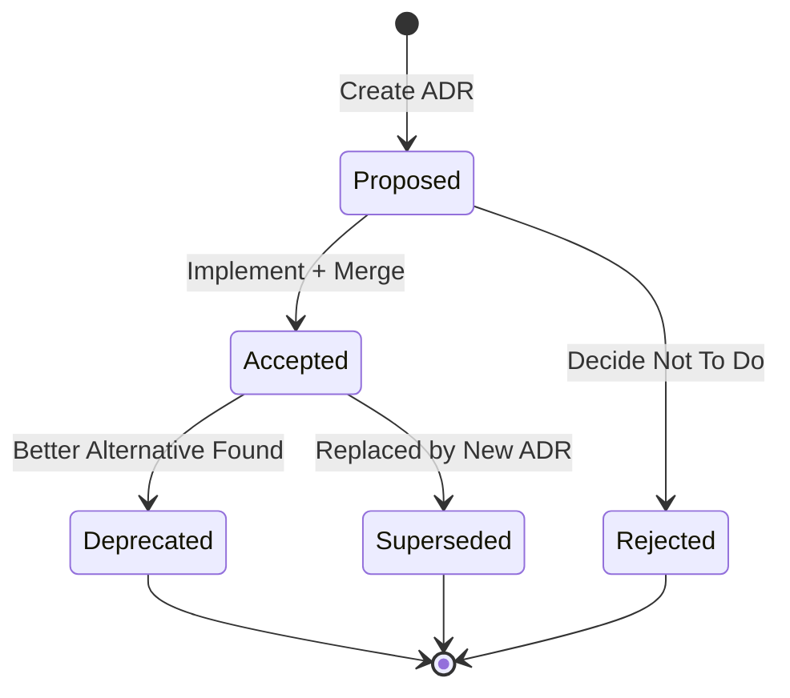

# Documentation Maintenance

Processes and guidelines for keeping architecture documentation up-to-date.

## Maintenance Philosophy

**Documentation is a living artifact.** As the codebase evolves, documentation must evolve with it to remain useful. Outdated documentation is worse than no documentation—it misleads developers and creates technical debt.

### Core Principles

1. **Documentation is Code**: Treat docs with same rigor as implementation
2. **Update Atomically**: Documentation changes accompany code changes in same PR
3. **Review Thoroughly**: Architecture docs require same review scrutiny as code
4. **Automate Where Possible**: Use tools to keep docs synced with reality

---

## When to Update Architecture Documentation

### Trigger Events

| Event | Docs to Update | Priority |
|-------|----------------|----------|
| New architectural pattern | C4 diagrams, ADR | 🔴 Critical |
| Change in threading model | threading-concurrency.md, ADR | 🔴 Critical |
| New optimization strategy | data-flow.md, c4-model.md | 🟡 High |
| Dependency change | deployment.md, README.md | 🟡 High |
| Performance optimization | data-flow.md, quality-attributes.md | 🟢 Medium |
| Bug fix (architectural) | Relevant ADR, add note | 🟢 Medium |
| Minor refactor | Code comments, possibly c4-model.md | 🔵 Low |

### Update Checklist

Before merging a PR that changes architecture:

- [ ] **README.md**: Is overview still accurate?
- [ ] **CLAUDE.md**: Are guidelines still valid?
- [ ] **C4 Model**: Do diagrams reflect new structure?
- [ ] **Data Flow**: Are processing steps current?
- [ ] **Threading Docs**: Are concurrency patterns documented?
- [ ] **ADRs**: Should a new ADR be created or existing one updated?
- [ ] **Deployment**: Do dependencies or requirements change?

---

## Documentation Update Process

### Step 1: Identify Impact

When making architectural changes, ask:

1. **What components are affected?**
   - Main thread behavior?
   - Worker thread pattern?
   - Subprocess communication?
   - Data structures?

2. **What decisions are changed?**
   - New architectural pattern?
   - Reversal of previous decision?
   - New constraint introduced?

3. **What diagrams need updates?**
   - C4 Context/Container/Component?
   - Data flow sequence diagrams?
   - Threading model diagrams?

### Step 2: Update Documentation

```bash
# Example: Adding a new optimization strategy

# 1. Update data flow documentation
vim docs/architecture/data-flow.md
# Add new strategy to Stage 3: Portfolio Optimization

# 2. Update C4 Component diagram
vim docs/architecture/c4-model.md
# Add new component/function if applicable

# 3. Create ADR if decision is significant
vim docs/architecture/adr/0009-new-optimization-strategy.md

# 4. Update CHANGELOG.md
vim CHANGELOG.md
# Document user-facing changes

# 5. Update README.md if user workflow changes
vim README.md
```

### Step 3: Validate Documentation

```bash
# Check Markdown syntax
markdownlint docs/architecture/**/*.md

# Check Mermaid diagram syntax (if using mermaid-cli)
mmdc -i docs/architecture/c4-model.md -o /tmp/test.svg

# Check internal links
markdown-link-check docs/architecture/**/*.md
```

### Step 4: Commit Atomically

```bash
# Good: Documentation in same commit as implementation
git add src/optimizer.py docs/architecture/data-flow.md docs/architecture/adr/0009-*.md
git commit -m "feat: add risk parity optimization strategy

- Implement RiskParityOptimization in src/optimizer.py
- Update data flow docs with new strategy
- Add ADR-0009 documenting decision rationale

Closes #42"

# Bad: Documentation in separate commit or forgotten
git add src/optimizer.py
git commit -m "add risk parity optimization"
# (docs never updated)
```

---

## Architecture Decision Records (ADRs)

### When to Create a New ADR

Create an ADR when:
- ✅ Choosing between multiple architectural approaches
- ✅ Introducing a new architectural pattern (e.g., caching layer)
- ✅ Changing a fundamental constraint (e.g., adding persistence)
- ✅ Reversing a previous decision
- ✅ Technology choice with long-term implications

Do NOT create an ADR for:
- ❌ Minor refactorings (rename variable, extract function)
- ❌ Bug fixes (unless they reveal architectural flaw)
- ❌ Dependency version bumps
- ❌ Configuration changes

### ADR Lifecycle



### Updating Existing ADRs

**When ADR is Superseded**:

```markdown
# ADR-0001: Use Threading for PyWebView

**Status**: Superseded by ADR-0010 (Use Multiprocessing for PyWebView)

**Date**: 2024-01-10 (Superseded: 2024-01-15)

## Context

(Original content...)

## Decision

(Original content...)

## Superseded By

This decision was superseded by [ADR-0010: Multiprocessing for PyWebView](./0010-multiprocessing-for-webview.md) due to main thread conflict with Textual.
```

**When ADR is Deprecated**:

```markdown
# ADR-0005: Use SQLite for Caching

**Status**: Deprecated

**Date**: 2024-01-12 (Deprecated: 2024-01-16)

## Deprecation Rationale

This decision was deprecated in favor of a stateless architecture ([ADR-0007](./0007-stateless-application.md)). Data freshness was prioritized over performance.
```

---

## Automated Documentation Validation

### Pre-Commit Hooks

```yaml
# .pre-commit-config.yaml
repos:
  - repo: https://github.com/markdownlint/markdownlint
    rev: v0.12.0
    hooks:
      - id: markdownlint
        files: ^docs/.*\.md$

  - repo: https://github.com/tcort/markdown-link-check
    rev: v3.11.2
    hooks:
      - id: markdown-link-check
        files: ^docs/.*\.md$

  - repo: local
    hooks:
      - id: check-adr-index
        name: Check ADR Index
        entry: python scripts/check_adr_index.py
        language: python
        files: ^docs/architecture/adr/.*\.md$
```

### CI Validation

```yaml
# .github/workflows/docs.yml
name: Documentation
on: [pull_request]

jobs:
  validate-docs:
    runs-on: ubuntu-latest
    steps:
      - uses: actions/checkout@v3

      - name: Check Markdown syntax
        uses: avto-dev/markdown-lint@v1
        with:
          config: '.markdownlint.json'
          args: 'docs/**/*.md'

      - name: Check dead links
        uses: gaurav-nelson/github-action-markdown-link-check@v1
        with:
          use-quiet-mode: 'yes'
          folder-path: 'docs/architecture'

      - name: Validate Mermaid diagrams
        run: |
          npm install -g @mermaid-js/mermaid-cli
          find docs/architecture -name "*.md" -exec mmdc -i {} -o /dev/null \;

      - name: Check ADR numbering
        run: python scripts/check_adr_index.py
```

---

## Documentation Versioning

### Strategy: Version with Code

- Documentation lives in same repository as code
- Documentation is versioned with git tags
- Each release tag includes corresponding documentation

```bash
# Release v1.0.0 includes docs at that point in time
git checkout v1.0.0
cat docs/architecture/README.md  # v1.0.0 docs

# Release v1.1.0 may have updated docs
git checkout v1.1.0
cat docs/architecture/README.md  # v1.1.0 docs (potentially different)
```

### Documentation Changelog

Track documentation changes in `CHANGELOG.md`:

```markdown
## [1.1.0] - 2024-02-01

### Added
- New optimization strategy: Risk Parity (ADR-0009)
- Documentation: Quality attributes and performance benchmarks

### Changed
- Updated data flow diagram with parallel ticker fetching
- Revised threading model documentation with cancellation patterns

### Fixed
- Corrected C4 component diagram (missing error handler)
```

---

## Review Guidelines

### Documentation Review Checklist

When reviewing PRs with documentation changes:

#### Accuracy
- [ ] Does documentation match implementation?
- [ ] Are all code references (file:line) correct?
- [ ] Are diagrams consistent with code structure?
- [ ] Are performance claims backed by data?

#### Completeness
- [ ] Are all affected documents updated?
- [ ] Are cross-references valid?
- [ ] Are alternatives documented (especially in ADRs)?
- [ ] Are trade-offs clearly explained?

#### Clarity
- [ ] Is writing clear and concise?
- [ ] Are technical terms defined?
- [ ] Are diagrams properly labeled?
- [ ] Is rationale explained (not just "what" but "why")?

#### Style
- [ ] Consistent Markdown formatting?
- [ ] Follows existing documentation structure?
- [ ] No broken links?
- [ ] Mermaid diagrams render correctly?

### Red Flags

Watch out for:
- 🚩 **Vague language**: "Usually", "mostly", "sometimes" without specifics
- 🚩 **Outdated references**: Links to removed files or functions
- 🚩 **Missing rationale**: Stating decisions without explaining "why"
- 🚩 **Copy-paste errors**: Inconsistent naming across docs
- 🚩 **No consequences**: ADRs without trade-off discussion

---

## Documentation Debt Tracking

### Creating Documentation TODOs

When implementation changes but documentation can't be updated immediately:

```python
# src/optimizer.py

# TODO(docs): Update docs/architecture/data-flow.md
# with new risk parity strategy flow (ADR-0009)
def risk_parity_allocation(prices):
    ...
```

```markdown
<!-- docs/architecture/data-flow.md -->

## Stage 3: Portfolio Optimization

<!-- TODO: Add risk parity strategy documentation (see ADR-0009) -->

Current strategies:
- Max Sharpe
- Min Volatility
- Max Utility
```

### Tracking Documentation Issues

Use GitHub issues with `documentation` label:

```markdown
**Title**: Update threading docs with cancellation pattern

**Labels**: documentation, enhancement

**Description**:
Worker thread cancellation was implemented in #123 but threading-concurrency.md
was not updated.

**Tasks**:
- [ ] Add cancellation pattern to threading-concurrency.md
- [ ] Update code examples with `get_current_worker().is_cancelled`
- [ ] Add sequence diagram for cancellation flow

**Related**:
- PR #123 (implementation)
- ADR-0002 (Worker Thread Pattern)
```

---

## Tools and Automation Scripts

### Script: Check ADR Numbering

```python
#!/usr/bin/env python3
# scripts/check_adr_index.py

import re
from pathlib import Path

adr_dir = Path("docs/architecture/adr")
adr_files = sorted(adr_dir.glob("0*.md"))

# Check sequential numbering
expected = 1
for adr_file in adr_files:
    match = re.match(r"(\d{4})-", adr_file.name)
    if not match:
        print(f"❌ Invalid ADR filename: {adr_file.name}")
        continue

    num = int(match.group(1))
    if num != expected:
        print(f"❌ ADR numbering gap: expected {expected:04d}, found {num:04d}")

    expected = num + 1

# Check index is up-to-date
index_file = adr_dir / "README.md"
index_content = index_file.read_text()

for adr_file in adr_files:
    if adr_file.name not in index_content:
        print(f"❌ Missing from index: {adr_file.name}")

print("✅ ADR numbering and index validated")
```

### Script: Generate Dependency Graph

```python
#!/usr/bin/env python3
# scripts/generate_dependency_graph.py

import ast
from pathlib import Path

def extract_imports(file_path):
    with open(file_path) as f:
        tree = ast.parse(f.read())

    imports = []
    for node in ast.walk(tree):
        if isinstance(node, ast.Import):
            imports.extend(alias.name for alias in node.names)
        elif isinstance(node, ast.ImportFrom):
            imports.append(node.module)

    return [imp for imp in imports if imp and imp.startswith("src.")]

# Generate Mermaid graph
print("```mermaid")
print("graph TD")

for py_file in Path("src").glob("*.py"):
    if py_file.name == "__init__.py":
        continue

    module = py_file.stem
    imports = extract_imports(py_file)

    for imp in imports:
        dep = imp.replace("src.", "")
        print(f"    {module} --> {dep}")

print("```")
```

---

## Documentation Ownership

### Responsibility Matrix

| Document | Primary Owner | Reviewer | Update Frequency |
|----------|---------------|----------|------------------|
| README.md | Product Lead | All | Every release |
| CLAUDE.md | Tech Lead | All | When patterns change |
| C4 Model | Architect | Tech Lead | When structure changes |
| Data Flow | Backend Dev | Architect | When pipeline changes |
| Threading | Concurrency Expert | Tech Lead | When patterns change |
| ADRs | Decision Makers | All | When decisions made |
| Deployment | DevOps | Tech Lead | When infrastructure changes |

### Documentation Stewardship

- **Architect**: Owns overall documentation coherence
- **Tech Lead**: Reviews all documentation PRs
- **All Developers**: Responsible for updating docs they touch

---

## Metrics and Health

### Documentation Health Indicators

| Metric | Target | How to Measure |
|--------|--------|----------------|
| Documentation coverage | 100% of modules | `grep -r "# TODO(docs)"` should be empty |
| Link validity | 0 broken links | Run markdown-link-check in CI |
| Staleness | < 3 months | Check git log for last update dates |
| ADR completeness | All decisions documented | Review quarterly |
| Diagram accuracy | No drift from code | Manual review during releases |

### Quarterly Documentation Audit

Every 3 months:

1. **Review all ADRs**: Are any now obsolete? Should any be deprecated?
2. **Validate diagrams**: Do C4 and data flow diagrams match codebase?
3. **Check references**: Are all file:line references still accurate?
4. **Update dependencies**: Has deployment documentation kept up with dependency changes?
5. **Gather feedback**: Are developers able to find information they need?

---

## Onboarding New Developers

### Documentation Reading Order

For new team members:

1. **Start here**: `README.md` (5 minutes)
2. **Development guide**: `CLAUDE.md` (15 minutes)
3. **Architecture overview**: `docs/architecture/README.md` (10 minutes)
4. **Deep dive**:
   - `docs/architecture/c4-model.md` (20 minutes)
   - `docs/architecture/data-flow.md` (30 minutes)
   - `docs/architecture/threading-concurrency.md` (30 minutes)
5. **Historical context**: Browse `docs/architecture/adr/` (as needed)

### Documentation Feedback Loop

Encourage new developers to:
- Ask "why" questions → may reveal gaps in documentation
- Propose clarifications → fresh eyes catch confusion
- Update as they learn → best time to improve onboarding docs

---

## Future Improvements

### Automation Opportunities

1. **Automatic diagram generation**: Extract C4 diagrams from code annotations
   ```python
   # @component: DataFetcher
   # @container: Core Business Logic
   # @description: Fetches Vietnamese stock data from vnstock3
   ```

2. **Live documentation server**: Deploy docs to GitHub Pages with search
   ```bash
   mkdocs serve  # Live preview at localhost:8000
   ```

3. **Documentation testing**: Test code examples in docs actually run
   ```python
   # doctest in documentation
   """
   >>> from src.optimizer import get_max_sharpe_allocation
   >>> result = get_max_sharpe_allocation(sample_data, 0.03)
   >>> assert 'allocation' in result
   """
   ```

4. **Changelog automation**: Generate CHANGELOG from commit messages
   ```bash
   git-cliff > CHANGELOG.md
   ```

---

## References

- Diátaxis Framework (Documentation System): https://diataxis.fr/
- Arc42 Documentation Template: https://arc42.org/
- C4 Model: https://c4model.com/
- ADR Tools: https://adr.github.io/
- Markdown Guide: https://www.markdownguide.org/
- Mermaid Documentation: https://mermaid.js.org/
