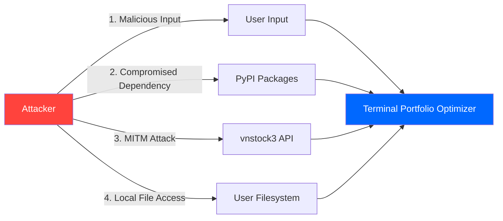

# Security Architecture

Security model, threat analysis, and defensive measures for Terminal Portfolio Optimizer.

## Security Posture

**Risk Profile**: Low to Medium
- **Desktop application** (not web-facing)
- **Single-user** (no multi-tenancy)
- **No authentication** required (public API)
- **No sensitive data persistence** (stateless architecture)
- **External API dependency** (vnstock3)

**Security Philosophy**: Defense in depth with privacy-first design

---

## Threat Model

### STRIDE Analysis

#### Spoofing Identity
- **Threat**: Malicious actor impersonates vnstock3 API
- **Likelihood**: Low (HTTPS with certificate validation)
- **Impact**: Medium (users receive false stock data)
- **Mitigation**: TLS certificate pinning (future), domain validation

#### Tampering with Data
- **Threat**: Man-in-the-middle modifies API responses
- **Likelihood**: Low (HTTPS encryption)
- **Impact**: High (users optimize based on tampered data)
- **Mitigation**: HTTPS enforced, no HTTP fallback

#### Repudiation
- **Threat**: User claims they didn't perform optimization
- **Likelihood**: N/A (no audit requirements)
- **Impact**: N/A
- **Mitigation**: Not applicable for desktop app

#### Information Disclosure
- **Threat**: Portfolio allocations leaked to unauthorized party
- **Likelihood**: Low (no network transmission, no storage)
- **Impact**: Medium (sensitive financial data)
- **Mitigation**:
  - No data persistence ([ADR-0007](./adr/0007-stateless-application.md))
  - No telemetry
  - Memory-only storage

#### Denial of Service
- **Threat**: Resource exhaustion via large inputs
- **Likelihood**: Low (user controls inputs)
- **Impact**: Low (crashes local app, no service disruption)
- **Mitigation**: Input validation, resource limits

#### Elevation of Privilege
- **Threat**: App gains unauthorized system access
- **Likelihood**: Very Low (no privilege escalation)
- **Impact**: High (system compromise)
- **Mitigation**: Runs with user privileges, no sudo/admin required

---

## Attack Surface Analysis

### Attack Vectors



#### 1. User Input Attack Surface

**Entry Points**:
- Ticker symbols (comma-separated string)
- Start/end dates (YYYY-MM-DD format)
- Risk-free rate (float)
- Risk aversion parameter (float)

**Threats**:
- Command injection (via ticker strings)
- Path traversal (via date strings)
- Integer overflow (via numeric inputs)

**Mitigations**:
```python
# src/main.py:146-179
def validate_inputs(tickers_str, start_date, end_date, rf_rate, risk_aversion):
    # 1. Ticker validation
    tickers = [t.strip().upper() for t in tickers_str.split(',')]
    for ticker in tickers:
        if not re.match(r'^[A-Z]{3,4}$', ticker):
            return False, f"Invalid ticker format: {ticker}"

    # 2. Date validation (strict format)
    try:
        start = datetime.strptime(start_date, '%Y-%m-%d')
        end = datetime.strptime(end_date, '%Y-%m-%d')
    except ValueError:
        return False, "Invalid date format"

    # 3. Numeric bounds checking
    try:
        rf = float(rf_rate)
        if not (0 <= rf <= 100):
            return False, "Risk-free rate must be 0-100%"
    except ValueError:
        return False, "Invalid risk-free rate"

    # 4. No shell command execution with user input
    # All API calls use library functions, not subprocess
```

**Current Gaps**:
- No rate limiting on user inputs
- No length limits on ticker list (could exhaust memory)

**Recommended Improvements**:
```python
# Future: Stricter validation
MAX_TICKERS = 30
MAX_DATE_RANGE_DAYS = 3650  # 10 years

if len(tickers) > MAX_TICKERS:
    return False, f"Too many tickers (max {MAX_TICKERS})"

if (end - start).days > MAX_DATE_RANGE_DAYS:
    return False, f"Date range too large (max {MAX_DATE_RANGE_DAYS} days)"
```

---

#### 2. Dependency Attack Surface

**Supply Chain Risk**: 7 direct dependencies, ~30 transitive dependencies

**Direct Dependencies**:
```toml
[project]
dependencies = [
    "textual>=0.47.0",          # UI framework
    "vnstock3>=0.1.5",          # Vietnamese stock data
    "pyportfolioopt>=1.5.5",    # Portfolio optimization
    "plotly>=5.18.0",           # Visualization
    "pywebview>=4.4.1",         # Native webview
    "pandas>=2.1.0",            # Data manipulation
    "numpy>=1.24.0",            # Numerical computing
]
```

**Threat Scenarios**:
1. **Compromised PyPI package**: Attacker uploads malicious version
2. **Typosquatting**: User installs `textua1` instead of `textual`
3. **Dependency confusion**: Attacker uploads package with same name to public PyPI

**Mitigations**:

1. **Dependency Pinning** (current):
```toml
# Minimum versions specified
textual>=0.47.0
```

**Future: Exact Pinning**:
```toml
textual==0.47.1
vnstock3==0.1.5
```

2. **Hash Verification** (future):
```bash
# Generate requirements with hashes
pip-compile --generate-hashes pyproject.toml > requirements.txt

# Install with hash verification
pip install --require-hashes -r requirements.txt
```

3. **Automated Vulnerability Scanning**:
```yaml
# .github/workflows/security.yml
- name: Scan dependencies
  run: |
    pip install pip-audit
    pip-audit
```

4. **Software Bill of Materials (SBOM)**:
```bash
# Generate SBOM
pip install cyclonedx-bom
cyclonedx-py -o sbom.json
```

---

#### 3. Network Attack Surface

**External Communication**:
- vnstock3 API (HTTPS to VCI data provider)
- No other network traffic

**Threat Scenarios**:
1. **Man-in-the-Middle (MITM)**: Attacker intercepts API requests
2. **DNS Spoofing**: Attacker redirects API calls to malicious server
3. **SSL/TLS Downgrade**: Attacker forces HTTP connection

**Current Mitigations**:
- vnstock3 uses `requests` library with default TLS verification
- HTTPS enforced (no HTTP fallback)

**Verification**:
```python
# src/data_fetcher.py (vnstock3 internal)
import requests

response = requests.get(
    url,
    verify=True  # Default: Verify TLS certificates
)
```

**Future: Certificate Pinning**:
```python
# Pin expected certificate for vnstock3 API
import certifi
import ssl

def create_pinned_context():
    context = ssl.create_default_context(cafile=certifi.where())
    # Pin expected certificate fingerprint
    context.check_hostname = True
    context.verify_mode = ssl.CERT_REQUIRED
    return context
```

**Future: Request Signing**:
```python
# Verify API response integrity (if API provides signatures)
import hmac
import hashlib

def verify_response_signature(response_body, signature, secret):
    expected = hmac.new(secret.encode(), response_body, hashlib.sha256).hexdigest()
    return hmac.compare_digest(expected, signature)
```

---

#### 4. Local File System Attack Surface

**File Access**:
- **Read**: None (no config files, no data files)
- **Write**: None (stateless architecture per [ADR-0007](./adr/0007-stateless-application.md))
- **Execute**: Python source code only (no dynamic code execution)

**Threat Scenarios**:
1. **Path Traversal**: Attacker tricks app into reading /etc/passwd
2. **Arbitrary File Write**: Attacker writes malicious file to disk
3. **Code Injection**: Attacker injects Python code via user input

**Current Mitigations**:
- No file I/O operations with user-controlled paths
- No `eval()`, `exec()`, or `compile()` of user input
- No dynamic imports based on user input

**Code Review**:
```bash
# Audit for dangerous functions
grep -r "eval\|exec\|compile\|__import__" src/

# Audit for file operations
grep -r "open\|read\|write\|os.system\|subprocess" src/

# Results: Only subprocess used for PyWebView (safe, no user input)
# src/visualizer.py:401: subprocess.Popen([sys.executable, webview_process_path, html_b64])
```

---

## Authentication and Authorization

### Current State: Not Applicable

- **No authentication**: Public API, no user accounts
- **No authorization**: All users have same privileges
- **No session management**: Stateless app

### Future: If Multi-User Features Added

If app evolves to server-side deployment:

```python
# Example: OAuth2 for user authentication
from authlib.integrations.requests_client import OAuth2Session

def authenticate_user():
    oauth = OAuth2Session(
        client_id=os.getenv('OAUTH_CLIENT_ID'),
        client_secret=os.getenv('OAUTH_CLIENT_SECRET'),
        redirect_uri='http://localhost:8000/callback'
    )
    authorization_url, state = oauth.create_authorization_url('https://provider.com/authorize')
    return authorization_url
```

---

## Data Protection

### Data Classification

| Data Type | Sensitivity | Storage | Transmission | Retention |
|-----------|-------------|---------|--------------|-----------|
| Portfolio allocations | High (confidential) | Memory only | None | Session only |
| Stock tickers | Low (public) | Memory only | HTTPS to API | Session only |
| Historical prices | Low (public) | Memory only | HTTPS from API | Session only |
| User inputs | Medium | Memory only | None | Session only |

### Data at Rest

**Current**: No data at rest (zero persistence)

**Future**: If persistence added (requires explicit user opt-in)

```python
# Example: Encrypted config file
from cryptography.fernet import Fernet

def save_config(config, password):
    # Derive key from password
    key = Fernet.generate_key()  # Use PBKDF2 in production
    cipher = Fernet(key)

    # Encrypt config
    config_json = json.dumps(config).encode()
    encrypted = cipher.encrypt(config_json)

    # Save to disk
    with open('~/.config/tpo/config.enc', 'wb') as f:
        f.write(encrypted)
```

### Data in Transit

**Current**:
- HTTPS for vnstock3 API calls (encrypted)
- No other network transmission
- Subprocess communication via command-line args (local, not networked)

**Future**: If web UI added
- TLS 1.3 minimum
- HSTS headers
- Certificate pinning

### Data in Memory

**Current Risk**: Portfolio allocations in memory (Python strings/dicts)

**Mitigation**:
- Memory cleared when Python GC runs
- No core dumps by default on macOS/Linux

**Future: Secure Memory Handling**:
```python
# Example: Zeroize sensitive data after use
import ctypes

def zeroize(data):
    # Overwrite memory with zeros
    if isinstance(data, str):
        data = data.encode()
    ctypes.memset(id(data), 0, len(data))

# Usage
allocation = {'FPT': 0.35, 'VNM': 0.65}
# ... use allocation ...
zeroize(str(allocation))  # Clear from memory
```

---

## Privacy

### Privacy Principles

1. **Data Minimization**: Collect only what's needed (currently: nothing)
2. **Purpose Limitation**: Use data only for stated purpose
3. **Storage Limitation**: Retain data only as long as needed (currently: session only)
4. **Transparency**: User knows what data is used
5. **User Control**: User controls their data

### Current Privacy Posture

✅ **No telemetry or analytics**
✅ **No user tracking**
✅ **No data persistence**
✅ **No third-party data sharing**
✅ **No cookies or local storage**

### Future: If Telemetry Added

Requires explicit opt-in:

```python
# Example: Privacy-preserving telemetry
def track_event(event_name, properties):
    # Only if user opted in
    if not os.getenv("TPO_TELEMETRY_ENABLED") == "1":
        return

    # Anonymize user identifier
    user_id = hashlib.sha256(socket.gethostname().encode()).hexdigest()[:8]

    # Aggregate, don't send raw data
    aggregated = {
        "event": event_name,
        "user_id": user_id,  # Anonymized
        "num_tickers": properties.get("num_tickers"),  # Count, not actual tickers
        "duration_ms": properties.get("duration_ms"),
        "timestamp": datetime.utcnow().isoformat()
    }

    # Send to analytics endpoint
    requests.post("https://analytics.example.com/track", json=aggregated)
```

**Privacy Policy** (required if telemetry added):
- Clear explanation of what data is collected
- How data is used
- How data is anonymized
- How user can opt out
- How long data is retained

---

## Security Best Practices

### Secure Coding Guidelines

#### 1. Input Validation

```python
# ✅ GOOD: Whitelist validation
def validate_ticker(ticker: str) -> bool:
    return bool(re.match(r'^[A-Z]{3,4}$', ticker))

# ❌ BAD: Blacklist validation
def validate_ticker_bad(ticker: str) -> bool:
    return ";" not in ticker and "|" not in ticker  # Incomplete
```

#### 2. Error Handling

```python
# ✅ GOOD: Generic error messages to user
try:
    data = fetch_data(ticker)
except Exception as e:
    logger.error(f"Fetch failed for {ticker}: {e}")  # Log details
    return "Failed to fetch data"  # Generic message to user

# ❌ BAD: Leak implementation details
except Exception as e:
    return f"SQL error: {e}"  # Reveals database info
```

#### 3. Dependency Management

```python
# ✅ GOOD: Pin dependencies
textual==0.47.1
vnstock3==0.1.5

# ❌ BAD: Unpinned dependencies
textual  # Could install vulnerable version
```

#### 4. No Hardcoded Secrets

```python
# ✅ GOOD: Environment variables
api_key = os.getenv("VNSTOCK_API_KEY")

# ❌ BAD: Hardcoded
api_key = "sk-1234567890abcdef"  # NEVER do this
```

---

## Incident Response

### Security Incident Types

1. **Dependency Vulnerability**: Known CVE in dependency
2. **Data Breach**: User's portfolio data exposed
3. **API Compromise**: vnstock3 API returns malicious data
4. **Supply Chain Attack**: Compromised PyPI package

### Response Procedure

#### Step 1: Detection
- GitHub Dependabot alerts
- pip-audit in CI pipeline
- User reports

#### Step 2: Assessment
- Determine severity (CVSS score)
- Identify affected versions
- Assess user impact

#### Step 3: Mitigation
- Patch vulnerable dependency
- Release emergency update
- Notify users (GitHub Security Advisory)

#### Step 4: Communication
- Create GitHub Security Advisory
- Update CHANGELOG.md with security fix
- Post to release notes

#### Step 5: Post-Mortem
- Document incident
- Update security practices
- Add regression tests

---

## Compliance and Standards

### Applicable Standards

| Standard | Applicability | Status |
|----------|---------------|--------|
| OWASP Top 10 | Web apps | N/A (desktop app) |
| NIST Cybersecurity Framework | General security | Informally followed |
| ISO 27001 | Information security | Not certified |
| GDPR | User privacy | Compliant (no data collection) |
| SOC 2 | Service providers | N/A (no service) |

### Future: If Deployed as Service

Would need to consider:
- **GDPR** (if EU users): Data subject rights, consent, breach notification
- **SOC 2**: Security, availability, confidentiality controls
- **PCI DSS**: If payment processing added

---

## Security Testing

### Current State: No Security Testing

### Future: Security Test Plan

#### 1. Static Analysis (SAST)

```yaml
# .github/workflows/security.yml
- name: Run Bandit (Python SAST)
  run: |
    pip install bandit
    bandit -r src/ -f json -o bandit-report.json

- name: Run Semgrep
  run: |
    pip install semgrep
    semgrep --config=p/security-audit src/
```

#### 2. Dependency Scanning (SCA)

```yaml
- name: Scan dependencies
  run: |
    pip install pip-audit safety
    pip-audit
    safety check --json
```

#### 3. Dynamic Analysis (DAST)

Not applicable for desktop app (no web interface to scan)

#### 4. Penetration Testing

**Scope**: Input validation, dependency vulnerabilities
**Frequency**: Annually or before major releases

---

## Security Checklist

### Pre-Release Security Review

- [ ] All dependencies up-to-date and scanned
- [ ] No hardcoded secrets in code
- [ ] Input validation on all user inputs
- [ ] Error messages don't leak sensitive info
- [ ] HTTPS enforced for API calls
- [ ] No arbitrary code execution paths
- [ ] CHANGELOG includes security fixes (if any)
- [ ] Security advisory created (if CVE fixed)

### Dependency Update Checklist

- [ ] Check for breaking changes
- [ ] Review release notes for security fixes
- [ ] Run pip-audit after update
- [ ] Test full application workflow
- [ ] Update pyproject.toml version constraints
- [ ] Update CHANGELOG.md

---

## References

- OWASP Secure Coding Practices: https://owasp.org/www-project-secure-coding-practices-quick-reference-guide/
- NIST Cybersecurity Framework: https://www.nist.gov/cyberframework
- Python Security Best Practices: https://python.readthedocs.io/en/stable/library/security_warnings.html
- Bandit (Python SAST): https://bandit.readthedocs.io/
- pip-audit: https://pypi.org/project/pip-audit/
- Related: [ADR-0007: Stateless Application](./adr/0007-stateless-application.md)
