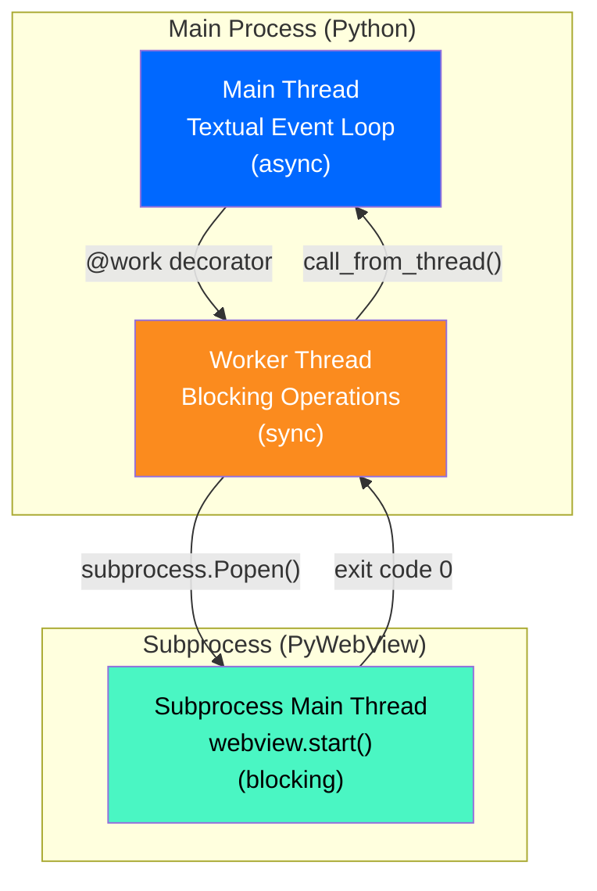

# Threading and Concurrency Architecture

Comprehensive documentation of threading, multiprocessing, and concurrency patterns in Terminal Portfolio Optimizer.

## Overview

Terminal Portfolio Optimizer uses a **hybrid concurrency model**:

1. **Main Thread**: Textual async event loop for UI rendering and event handling
2. **Worker Threads**: Blocking I/O and CPU operations (data fetching, optimization)
3. **Subprocess**: PyWebView visualization in separate process

This architecture solves the fundamental conflict: **both Textual and PyWebView require the main thread**.

## Thread Architecture Diagram



## Thread Lifecycle

### 1. Application Startup

```python
# src/main.py:214-217
def main():
    app = PortfolioApp()
    app.run()

# Main thread enters Textual's async event loop
# Event loop handles:
# - Keyboard input (Ctrl+C, 'q')
# - Screen rendering
# - Widget updates
# - Timer callbacks
```

**Thread**: Main (Textual)
**Blocking**: No
**Duration**: Application lifetime

---

### 2. User Interaction

```python
# src/main.py:119-141
def on_button_pressed(self, event: Button.Pressed) -> None:
    # Runs on main event loop thread
    if event.button.id == "optimize-button":
        # Validation runs synchronously (< 10ms, acceptable)
        valid, error = self.validate_inputs(...)

        if valid:
            # Spawn worker thread
            self.run_optimization_worker(...)
```

**Thread**: Main (Textual)
**Blocking**: Yes (< 10ms for validation)
**Duration**: Synchronous callback

---

### 3. Worker Thread Execution

```python
# src/main.py:143-212
@work(thread=True, exclusive=True)
def run_optimization_worker(self):
    # Runs in separate OS thread
    try:
        # Blocking operation 1: Network I/O (2-5s)
        prices = fetch_vn_stock_data(tickers, start, end)

        # Blocking operation 2: CPU-intensive (500ms-1s)
        frontier = calculate_efficient_frontier(prices, rf_rate)
        random_portfolios = generate_random_portfolios(prices, rf_rate)
        max_sharpe = get_max_sharpe_allocation(prices, rf_rate)
        min_vol = get_min_volatility_allocation(prices)
        max_util = get_max_utility_allocation(prices, rf_rate, risk_aversion)

        # Blocking operation 3: Chart generation (100-200ms)
        html = create_enhanced_portfolio_chart(...)

        # Blocking operation 4: Subprocess launch + wait (3-5s)
        display_charts(html)  # Launches subprocess, waits for termination

        # Thread-safe UI update
        self.app.call_from_thread(
            self.query_one("#success-message").update,
            "Optimization complete!"
        )

    except Exception as e:
        self.app.call_from_thread(
            self.query_one("#error-message").update,
            f"Error: {str(e)}"
        )
```

**Thread**: Worker (spawned by `@work`)
**Blocking**: Yes (intentional - isolates blocking ops from main thread)
**Duration**: 5-10 seconds
**Concurrency**: `exclusive=True` → only one worker at a time

---

### 4. Subprocess Launch

```python
# src/visualizer.py:381-416
def display_charts(html_content: str) -> None:
    # Encode HTML as base64 for safe CLI passing
    html_bytes = html_content.encode('utf-8')
    html_b64 = base64.b64encode(html_bytes).decode('ascii')

    # Launch subprocess
    process = subprocess.Popen([
        sys.executable,
        str(webview_process_path),
        html_b64
    ])

    # Wait for subprocess termination (non-blocking for main thread)
    process.wait()
```

**Thread**: Worker
**Subprocess**: New Python interpreter with own main thread
**Blocking**: `process.wait()` blocks worker thread (NOT main thread)
**Duration**: Until user closes chart window

---

### 5. Subprocess Execution

```python
# src/webview_process.py:1-25
def main():
    # Decode HTML from command-line argument
    html_b64 = sys.argv[1]
    html = base64.b64decode(html_b64).decode('utf-8')

    # Create and display window (BLOCKS until user closes window)
    webview.create_window(
        'Portfolio Optimization Results',
        html=html,
        width=1400,
        height=900,
        vibrancy=False
    )
    webview.start()  # Runs on subprocess's main thread (satisfies Cocoa)

if __name__ == '__main__':
    main()
```

**Thread**: Subprocess main thread
**Blocking**: Yes (until window closes)
**Duration**: User-dependent (typically 30s-5min)
**Critical**: MUST run on main thread (macOS Cocoa NSWindow requirement)

---

### 6. UI Update from Worker

```python
# Thread-safe UI update pattern
self.app.call_from_thread(
    widget.update,
    new_value
)

# Under the hood:
# 1. Worker thread posts message to main event loop
# 2. Main event loop processes message on next tick
# 3. widget.update() executes on main thread (thread-safe)
```

**Thread**: Initiated by worker, executed on main
**Blocking**: No (async message passing)
**Duration**: < 10ms

---

## Thread Safety Patterns

### Pattern 1: Worker Thread Spawning

```python
# CORRECT: Use @work decorator
@work(thread=True, exclusive=True)
def my_blocking_operation(self):
    # Runs in worker thread
    result = expensive_computation()
    self.app.call_from_thread(self.update_ui, result)

# INCORRECT: Blocking on main thread
def on_button_pressed(self):
    result = expensive_computation()  # FREEZES UI!
    self.update_ui(result)
```

### Pattern 2: Thread-Safe UI Updates

```python
# CORRECT: From Screen class, use self.app.call_from_thread()
@work(thread=True)
def worker(self):
    data = fetch_data()
    self.app.call_from_thread(widget.update, data)

# INCORRECT: Screen doesn't inherit call_from_thread
@work(thread=True)
def worker(self):
    data = fetch_data()
    self.call_from_thread(widget.update, data)  # AttributeError!

# INCORRECT: Direct widget mutation from worker thread
@work(thread=True)
def worker(self):
    data = fetch_data()
    widget.update(data)  # NOT THREAD-SAFE!
```

### Pattern 3: Subprocess Communication

```python
# CORRECT: Base64-encoded argv
html_b64 = base64.b64encode(html.encode()).decode()
subprocess.Popen([sys.executable, "webview_process.py", html_b64])

# INCORRECT: Passing via stdin (doesn't work on macOS)
process = subprocess.Popen([...], stdin=subprocess.PIPE)
process.communicate(html.encode())  # Deadlock on macOS

# INCORRECT: Shared memory (complex, error-prone)
import multiprocessing
shared_mem = multiprocessing.Value('c', html.encode())
```

### Pattern 4: Worker Exclusivity

```python
# CORRECT: Prevent concurrent optimizations
@work(thread=True, exclusive=True)
def run_optimization_worker(self):
    # Only one instance runs at a time
    ...

# INCORRECT: Allow concurrent workers
@work(thread=True, exclusive=False)
def run_optimization_worker(self):
    # Multiple workers could run simultaneously
    # Risk: UI updates interleaved, confusing results
```

---

## Concurrency Constraints

### Main Thread Requirements

| Component | Requires Main Thread? | Reason |
|-----------|----------------------|--------|
| Textual Event Loop | ✅ Yes | Terminal control, async I/O |
| PyWebView `webview.start()` | ✅ Yes | macOS Cocoa NSWindow API |
| vnstock3 data fetching | ❌ No | Sync HTTP library, thread-safe |
| PyPortfolioOpt optimization | ❌ No | NumPy/CVXPY, thread-safe |
| Plotly chart generation | ❌ No | Pure Python, no GUI |

**Conflict**: Textual and PyWebView both need main thread
**Solution**: Run PyWebView in separate process → gets own main thread

---

## Race Conditions and Synchronization

### 1. Concurrent Optimization Prevention

**Problem**: User clicks "Optimize" multiple times rapidly

**Solution**: `@work(exclusive=True)` ensures only one worker runs

```python
@work(thread=True, exclusive=True)
def run_optimization_worker(self):
    # exclusive=True means:
    # - If worker already running, new request is queued
    # - Only one worker executes at a time
    # - Prevents race conditions on shared state
```

### 2. UI Update Ordering

**Problem**: Worker updates multiple UI elements from worker thread

**Solution**: All updates go through `call_from_thread()`, processed in order

```python
# Updates processed sequentially on main event loop
self.app.call_from_thread(self.query_one("#status").update, "Fetching data...")
# ... blocking operation ...
self.app.call_from_thread(self.query_one("#status").update, "Optimizing...")
# ... blocking operation ...
self.app.call_from_thread(self.query_one("#status").update, "Complete!")
```

### 3. Widget State Consistency

**Problem**: Input widgets modified while optimization running

**Current State**: Not explicitly prevented (user can change inputs mid-optimization)

**Risk**: Low (new inputs only affect next run, current worker has copies of values)

**Potential Improvement**:
```python
# Disable inputs during optimization
@work(thread=True, exclusive=True)
def run_optimization_worker(self):
    self.app.call_from_thread(self.disable_inputs)
    try:
        # ... optimization ...
    finally:
        self.app.call_from_thread(self.enable_inputs)
```

### 4. Subprocess Lifecycle

**Problem**: User quits app while PyWebView window open

**Current Behavior**: Main process exits, orphaned subprocess continues (subprocess not killed)

**Risk**: Low (PyWebView windows don't consume significant resources, user can close manually)

**Potential Improvement**:
```python
# Track subprocess and kill on app exit
class PortfolioApp(App):
    def __init__(self):
        super().__init__()
        self.active_processes = []

    def on_mount(self):
        atexit.register(self.cleanup_processes)

    def cleanup_processes(self):
        for proc in self.active_processes:
            if proc.poll() is None:  # Still running
                proc.terminate()
                proc.wait(timeout=1)
```

---

## Performance Characteristics

### Thread Creation Overhead

| Operation | Time | Details |
|-----------|------|---------|
| Worker thread spawn | ~5ms | Negligible, one-time per optimization |
| Subprocess spawn | ~1-2s | Significant, includes Python interpreter startup |
| Thread pool size | 1 | `exclusive=True` limits to one worker |
| Memory per thread | ~8MB | OS-dependent, stack size |

### Context Switching

```
[Main Thread] User clicks button (0ms)
  ↓ (5ms thread spawn)
[Worker Thread] Start optimization (0ms)
[Main Thread] Continue rendering UI (0ms)
  ↓ (3s network fetch)
[Worker Thread] Fetch complete (3000ms)
  ↓ (1s optimization)
[Worker Thread] Optimization complete (4000ms)
  ↓ (2s subprocess spawn + wait)
[Worker Thread] Subprocess launched (6000ms)
[Main Thread] Continue rendering (0ms)
[Subprocess] Display chart (until user closes)
  ↓ (user-dependent, ~30s)
[Worker Thread] Subprocess terminated (36000ms)
  ↓ (10ms UI update)
[Main Thread] Show success message (36010ms)
```

**Key Insight**: Main thread never blocks, UI remains responsive throughout

---

## Debugging and Observability

### Thread Identification

```python
import threading

def log_thread():
    thread_id = threading.get_ident()
    thread_name = threading.current_thread().name
    print(f"[{thread_name}:{thread_id}] Operation starting")

# Example output:
# [MainThread:4372145600] Button pressed
# [Worker-1:4388921600] Fetching data
# [MainThread:4372145600] UI update
```

### Worker Status Checking

```python
@work(thread=True)
def long_running_task(self):
    worker = get_current_worker()

    for i in range(1000):
        if worker.is_cancelled:
            print("Worker cancelled by user")
            return

        # Do work
        process_item(i)
```

### Deadlock Detection

**Potential Deadlock Scenario**:
```python
# DEADLOCK: Worker waits for main thread, main thread waits for worker
@work(thread=True)
def bad_worker(self):
    result = self.app.call_from_thread(blocking_function)  # BAD!
    # If blocking_function spawns another worker that waits for main thread...
    # Deadlock!
```

**Prevention**:
- Never call blocking functions via `call_from_thread()`
- Only use `call_from_thread()` for quick UI updates
- Document blocking vs non-blocking operations

---

## Platform-Specific Considerations

### macOS

**Threading Model**: Preemptive multithreading with Grand Central Dispatch (GCD)

**PyWebView Constraint**: NSWindow must be created on main thread
```python
# macOS Cocoa requirement
webview.start()  # MUST run on main thread, else NSException
```

**Terminal Control**: Textual uses `termios` for raw terminal mode (main thread)

### Linux

**Threading Model**: POSIX threads (pthreads)

**PyWebView Backend**: Uses GTK or Qt, also requires main thread

**Subprocess Behavior**: More predictable than macOS, faster spawn times

### Windows

**Not Tested**: Current implementation optimized for macOS/Linux

**Expected Issues**:
- PyWebView uses Edge WebView2, different threading requirements
- Subprocess shell behavior differs (`shell=True` might be needed)
- Terminal rendering may differ (ConPTY vs PTY)

---

## Concurrency Best Practices

### 1. Always Use Worker Threads for Blocking Operations

```python
# ✅ GOOD
@work(thread=True)
def fetch_and_process(self):
    data = requests.get(url)  # Blocking
    result = process(data)    # CPU-intensive
    self.app.call_from_thread(self.update, result)

# ❌ BAD
def on_button_pressed(self):
    data = requests.get(url)  # BLOCKS MAIN THREAD
    result = process(data)
    self.update(result)
```

### 2. Minimize Shared Mutable State

```python
# ✅ GOOD: Worker operates on local copies
@work(thread=True)
def worker(self, tickers, start_date, end_date):
    # Parameters passed by value, no shared state
    data = fetch(tickers, start_date, end_date)

# ❌ BAD: Worker reads from shared instance attributes
@work(thread=True)
def worker(self):
    # self.tickers might change during execution!
    data = fetch(self.tickers, self.start_date, self.end_date)
```

### 3. Use `exclusive=True` for Stateful Operations

```python
# ✅ GOOD: Only one optimization at a time
@work(thread=True, exclusive=True)
def run_optimization_worker(self):
    # Safe: No concurrent optimizations

# ❌ BAD: Multiple optimizations can run concurrently
@work(thread=True, exclusive=False)
def run_optimization_worker(self):
    # Risk: UI updates from multiple workers interleave
```

### 4. Always Use `call_from_thread()` for UI Updates

```python
# ✅ GOOD
@work(thread=True)
def worker(self):
    result = compute()
    self.app.call_from_thread(widget.update, result)

# ❌ BAD: Direct widget access from worker
@work(thread=True)
def worker(self):
    result = compute()
    widget.update(result)  # NOT THREAD-SAFE
```

### 5. Handle Exceptions in Worker Threads

```python
# ✅ GOOD: Catch and display errors
@work(thread=True)
def worker(self):
    try:
        result = risky_operation()
        self.app.call_from_thread(self.show_success, result)
    except Exception as e:
        self.app.call_from_thread(self.show_error, str(e))

# ❌ BAD: Uncaught exceptions crash worker silently
@work(thread=True)
def worker(self):
    result = risky_operation()  # If fails, user sees nothing
    self.app.call_from_thread(self.show_success, result)
```

---

## Future Improvements

### 1. Worker Cancellation

**Current State**: Workers run to completion, can't be cancelled

**Proposed**:
```python
@work(thread=True, exclusive=True)
def run_optimization_worker(self):
    worker = get_current_worker()

    # Check cancellation at safe points
    if worker.is_cancelled:
        return

    data = fetch_data()

    if worker.is_cancelled:
        return

    result = optimize(data)
    # ...
```

### 2. Progress Reporting

**Current State**: No progress indication during optimization

**Proposed**:
```python
@work(thread=True)
def run_optimization_worker(self):
    self.app.call_from_thread(self.progress.update, "Fetching data...")
    data = fetch_data()

    self.app.call_from_thread(self.progress.update, "Calculating frontier...")
    frontier = calculate_efficient_frontier(data)

    # ...
```

### 3. Subprocess Cleanup on Exit

**Current State**: Orphaned subprocesses if app exits while window open

**Proposed**: Register `atexit` handler to terminate active subprocesses

### 4. Thread Pool for Data Fetching

**Current State**: Sequential ticker fetching

**Proposed**: Fetch multiple tickers concurrently using `ThreadPoolExecutor`

```python
from concurrent.futures import ThreadPoolExecutor

def fetch_all_tickers(tickers, start, end):
    with ThreadPoolExecutor(max_workers=5) as executor:
        futures = [executor.submit(fetch_ticker, t, start, end) for t in tickers]
        results = [f.result() for f in futures]
    return pd.concat(results, axis=1)
```

---

## References

- Textual Workers: https://textual.textualize.io/guide/workers/
- Python Threading: https://docs.python.org/3/library/threading.html
- Python Subprocess: https://docs.python.org/3/library/subprocess.html
- PyWebView Threading: https://pywebview.flowrl.com/guide/api.html#start
- Related ADRs:
  - [ADR-0001: Multiprocessing for PyWebView](./adr/0001-multiprocessing-for-webview.md)
  - [ADR-0002: Worker Thread Pattern](./adr/0002-worker-thread-pattern.md)
